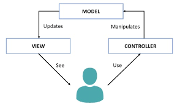

## 🧩 1. MVC'nin Soyut Görevi

Klasik **MVC** modelinde:

* **Model:** Veriyi ve iş mantığını temsil eder.
* **View:** Kullanıcıya gösterilen görünümü (UI) oluşturur.
* **Controller:** View’dan gelen etkileşimleri yakalar ve Model’i günceller.

Akış şeması:

```
Model → View (veri gösterimi)
View → Controller (kullanıcı etkileşimi)
Controller → Model (veri güncelleme)
```




---

## ⚙️ 2. Angular’da Bu Roller Nasıl Karşılanır?

Angular doğrudan “MVC framework” olarak tanımlanmaz ama **“MVVM (Model–View–ViewModel)”** tarzında çalışır.
Yine de Property ve Event Binding’in rolleri klasik MVC ilişkisine çok benzer.

| MVC Bileşeni   | Angular Karşılığı                                                          | Açıklama                                                 |
| -------------- | -------------------------------------------------------------------------- | -------------------------------------------------------- |
| **Model**      | Component Class (TS) içindeki veri (property’ler, servislerden gelen data) | Uygulama verisini ve mantığını taşır.                    |
| **View**       | HTML Template (component.html)                                             | Kullanıcıya gösterilen görünümü oluşturur.               |
| **Controller** | Component Class (TS) içindeki metotlar (event handler’lar)                 | Kullanıcı etkileşimlerine tepki verir, modeli günceller. |

---

## 🔁 3. Binding Mekanizmalarının MVC ile İlişkisi

* **Property Binding (`[ ]`) → Model → View**
  → Modeldeki veri değiştiğinde, View (HTML) otomatik olarak güncellenir.
  → MVC’de “Model → View” hattını temsil eder.

* **Event Binding (`( )`) → View → Controller**
  → Kullanıcı View’da bir etkileşim yaptığında (örneğin `click`), Controller (TS tarafı) bilgilendirilir.
  → MVC’de “View → Controller” hattını temsil eder.

* **Two-way Binding (`[(ngModel)]`) → Model ↔ View**
  → Bu, MVC’nin Model–View–Controller zincirini **reaktif biçimde tek bir köprüye** indirger.
  → Angular bunu “MVVM tarzı” bir modelle birleştirir.

---

## 🧠 4. Soyutlama Açıklaması

> Angular’da **Property Binding** ve **Event Binding**, klasik MVC’nin iki yönlü etkileşim akışını temsil eder.
>
> * Property Binding → Model verisinin View’a akışı
> * Event Binding → View etkileşimlerinin Component mantığına (Controller) akışı
>
> Fakat Angular, bu ilişkiyi *manual controller kodu* olmadan otomatikleştirir.
> Component hem “Model”i hem “Controller”i bünyesinde birleştirir — bu nedenle Angular, klasik MVC’nin **kompakt ve reaktif evrimi** olarak düşünülebilir.

---


### 🔹 Özet Cümle

> **Property Binding** ve **Event Binding**, Angular’ın MVC benzeri yapısında
> sırasıyla “Model’den View’a veri akışı” ve “View’dan Controller’a olay akışı” rollerini üstlenir.
>
> Ancak Angular’da bu iki yönlü etkileşim Component içinde birleştiği için, framework klasik MVC’yi **reaktif ve kapsüllenmiş** bir mimariye dönüştürür.

---

