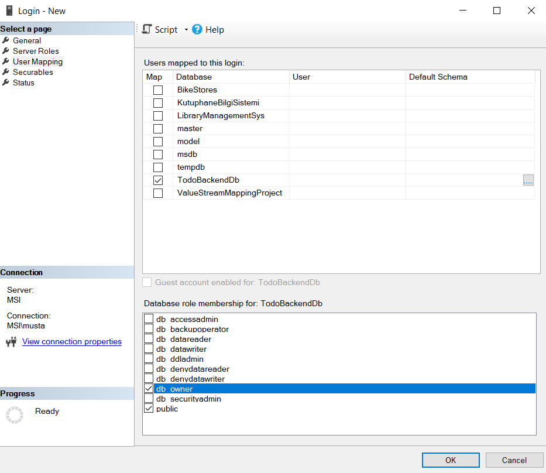

# 0) Production icin sectigim portlar

- 7000 (Backend)
- 7001 (Frontend)

## Port secerken dikkat edilmesi gerekenler

- Sistem tarafından rezerve edilmemiş (0-1023 arası gibi) portlar secilmeli
- Production ortami ile kendi kendi default development portlarimizin calismamasi icin farkli port secilmeli (orn 4200 angular default portu secilmemeli)


# 1) Backend ve Frontend projelerinin release halini olusturma

## a) Backend'de Release Surumu


- Backendde cors ayari yapilir. Suanki durumda frontenddeki production portumuz 7001 dolayisiyla cors ayarinda 7001 portuna izin verilmeli


- Komut: `dotnet publish -c Release`

    - `bin/Release/net8.0/publish` dizininde release dosyalari olusur

    - Clean Architecture mimarisinde TodoBackend.Api, TodoBackend.Domain, TodoBackend.Infrastrutcure, TodoBackendApplication isimli 4 adet projem var ve aralarinda proje bagimliliklari var.
        - Bu durumda endpointlerin oldugu Api dizininde yukaridaki komut calistirilir. 
        - `dotnet publish` kodu kendi icinde proje bagimliliklarini sirasiyla bularak derler


- Olusan publish dizini altindaki web.config dosyasinda `stdoutLogEnabled="false"` kismi `stdoutLogEnabled="true"` ile degisitirilmeli ve web.config'in oldugu dizinde `logs` klasoru olusturulmalidir, boylece loglar o klasor altina olusturulur


- DB'den soldaki `Security` kismindan `Logins` ustune tiklandiktan sonra `New Login` denilerek `IIS APPPOOL\TodoBackendApi` isminde IIS'in database'e baglanabilmesi icin yeni bir login olusturulmalidir. Ayrica su ayarlar da yapilmalidir:



## b) Frontend'de Release Surumu

- environment.prod.ts icindeki `apiUrl` kismi backend'in production port'u yazilir. 
    - Boylece frontend'in prodcution surumunde, backend'in production'daki url'sine http istegi atmasi saglanir


- angular.json icine su alan konulur (development icin olan environment dosyasini build'de, production icin olan environment dosyasi ile degistirir)
```json
            "production": {
              "fileReplacements": [
                {
                  "replace": "src/environments/environment.ts",
                  "with": "src/environments/environment.prod.ts"
                }
              ],
```


- `web.config` Ayari
    - index.html'in oldugu dizine `web.config` isminde bir dosya olustur ve icine asagidaki kismi yapistir.
    ```xml
    <?xml version="1.0"     encoding="UTF-8"?>
    <configuration>
      <system.webServer>
        <rewrite>
          <rules>
            <rule name="Angular Routes"     stopProcessing="true">
              <match url=".*" />
              <conditions   logicalGrouping="MatchAll"    >
                <add input="    {REQUEST_FILENAME}"     matchType="IsFile"  negate="true" />
                <add input="    {REQUEST_FILENAME}"     matchType="IsDirectory"     negate="true" />
              </conditions>
              <action type="Rewrite"    url="/" />
            </rule>
          </rules>
        </rewrite>
      </system.webServer>
    </configuration>
    ```

    - Ardindan `angular.json` icinde architect -> build -> options -> assets icinde `web.config` dosyasinin pathini ver. Bu web.config dosyasinin builde dahil edilmesini saglar

    ```json
    "architect": {
        "build": {
          // ...
          "options": {
            // ...
            "assets": [
              {
                "glob": "**/*",
                "input": "public"
              },
              {
                "glob": "**/*",
                "input": "./node_modules/@ant-design/icons-angular/src/inline-svg/",
                "output": "/assets/"
              },
              "src/web.config"
            ]
            // ...
          }
        }
    }
    ```


### 1\. Angular Proje Dizinine Gidin

Bir terminal (Komut İstemi, PowerShell veya VS Code'daki terminal) açın.
Angular projenizin ana dizinine `cd` komutu ile gidin (yani `angular.json` dosyasının olduğu yere).

### 2\. Build Komutunu Çalıştırın

Aşağıdaki komutu yazıp Enter'a basın:

```bash
ng build
```

Bu kadar.

Bu komut, `angular.json` dosyanızdaki ayarları (`"defaultConfiguration": "production"` ve `fileReplacements`) okuyacak, `environment.prod.ts` dosyanızdaki `apiUrl: 'http://localhost:7000/api'` ayarını alacak ve tüm projenizi "canlı" sürüm için optimize edip paketleyecektir.

(Notunuzda belirttiğiniz gibi, `angular.json` dosyasındaki `assets` dizisine `web.config` dosyanızı eklediyseniz, bu komut o dosyayı da otomatik olarak build klasörüne kopyalayacaktır.)

-----

### İşlem Bittiğinde Ne Olacak?

Bu komutun çalışması, projenizin büyüklüğüne bağlı olarak birkaç saniye veya bir dakika sürebilir. İşlem başarıyla bittiğinde, projenizin ana klasöründe **`dist`** adında yeni bir klasör göreceksiniz.

`dist` klasörünün içinde, projenizin adıyla (örn: `todo-frontend`) bir alt klasör daha olacak (veya modern Angular'da `dist/todo-frontend/browser` gibi bir yol).

**IIS'e "Fiziksel Yol" olarak göstereceğiniz klasör, içinde `index.html` dosyasının bulunduğu bu `dist/...` klasörüdür.**


---

### 1. `web.config` Nedir ve Hangi Problemi Çözer?

`web.config`, IIS sunucuları için bir yapılandırma dosyasıdır. Angular gibi (SPA - Single Page Application) modern frontend framework'leri IIS'te yayınlarken kritik bir rol oynar.

**Çözdüğü Problem:**
Angular, `index.html` yüklendikten sonra JavaScript kullanarak "sanal" sayfalar (örn: `/todos/detay/5`) oluşturur. IIS ise geleneksel bir sunucudur ve her URL'i disk üzerinde *fiziksel* bir dosya veya klasör olarak arar.

Bu iki farklı mantık, kullanıcı sayfayı yenilediğinde (F5) veya bir linke doğrudan gittiğinde çakışır ve IIS'in **404 Not Found (Sayfa Bulunamadı)** hatası vermesine neden olur.

### 2. Senaryo: `web.config` Olmadan (404 Hatası)

1.  Siteniz `http://localhost:7001` adresinde başarıyla açılır (çünkü `index.html`'i bulur).
2.  Siz site içinde bir linke tıklar ve `http://localhost:7001/todos/detay/5` adresine gidersiniz. (Bu, Angular'ın JavaScript'i sayesinde çalışır).
3.  **Sorunun Yaşandığı An:** Bu adresteyken tarayıcınızın **"Yenile" (F5)** tuşuna basarsınız.
4.  Tarayıcı, isteği doğrudan IIS'e gönderir: "Bana `/todos/detay/5` dosyasını ver."
5.  IIS, fiziksel `dist/todo-frontend` klasörünün içinde `/todos/detay/5` adında bir klasör/dosya arar.
6.  Böyle bir fiziksel dosya olmadığı için IIS, tarayıcıya **404 Not Found** hatası döndürür.

### 3. Çözüm: `web.config` Nasıl Çalışır?

`web.config` dosyası, IIS'in **URL Rewrite Module** eklentisini kullanarak bu davranışı düzeltir. IIS'e yeni bir kural talimatı verir:

> "Hey IIS! Sana bir istek geldiğinde, önce bir bak:
>
> 1.  Eğer bu istek, diskte var olan gerçek bir dosya **DEĞİLSE**
> 2.  VE bu istek, diskte var olan gerçek bir klasör **DEĞİLSE**
>
> ...o zaman 404 Hatası verme! Bunun yerine, o isteği ana `index.html` dosyasına **yeniden yönlendir** (`action type="Rewrite" url="/"`)."

### 4. Sonuç

Bu kural sayesinde, siz `http://localhost:7001/todos/detay/5` adresinde F5'e bastığınızda:

1.  IIS, `/todos/detay/5` adında bir dosya bulamaz.
2.  `web.config` kuralı devreye girer ve 404 hatası yerine `index.html`'i yükler.
3.  `index.html` yüklendiğinde, Angular'ın `main.js` dosyası da yüklenir.
4.  Angular Router çalışır, tarayıcının adres çubuğundaki `/todos/detay/5` yolunu okur ve "Tamam, kullanıcı `TodoDetailComponent`'i istiyor" diyerek doğru bileşeni ekrana çizer.

Kısacası, bu `web.config` dosyası, IIS'in "fiziksel dosya" takıntısını, Angular'ın "sanal rota" mantığıyla uyumlu hale getiren bir tercümandır.


# 2) IIS (Internet Information Services) ile production sureci


### 2) IIS Sunucu Kurulumu ve Hazırlığı (Unutulan Adımlar)

Backend tarafinda `dotnet publish` ile hazirladigimiz `publish` dizini ve frontendde `ng build` ile hazirladigimiz `dist` dizini, bu iki "tercüman" eklentisi olmadan IIS üzerinde çalışmayacaktır.

  * **ASP.NET Core Hosting Bundle Kurulumu:**

      * **Neden:** Bu eklenti, IIS'in sizin `.NET 8` (Core) projenizi nasıl çalıştıracağını bilmesini sağlayan "tercüman"dır. Bu olmadan, backend siteniz `500.x` sunucu hatası verir.
      * **Not:** Google'a ".NET 8 Hosting Bundle" yazıp Microsoft'un sitesinden indirin ve kurun.

  * **URL Rewrite Module Kurulumu:**

      * **Neden:** Frontend notlarınızda `web.config` dosyasının önemini çok güzel açıklamışsınız. Ancak, IIS'in o `web.config` dosyasının içindeki `<rewrite>` kurallarını okuyabilmesi için bu modülün kurulmuş olması gerekir. Bu modül olmadan, `web.config` dosyanız hiçbir işe yaramaz ve Angular rotalarınız (sayfa yenileyince) `404` hatası verir.
      * **Not:** Google'a "IIS URL Rewrite Module" yazıp indirin ve kurun.

  * **IIS Özelliklerini Aktif Etme:**

      * **Neden:** Bu ikisini kurmadan önce, "Windows özelliklerini aç veya kapat" ekranından IIS'in kendisini aktif etmeniz gerekir.
      * **Not:** `IIS Yönetim Konsolu`, `ASP.NET 4.8` ve `Statik İçerik` (Static Content) özelliklerini seçtiğinizden emin olun.

-----

### 3\) Hazırlanan Paketlerin IIS'e Yüklenmesi (Unutulan Adımlar)

Notlarınız paketleri "hazırlamayı" anlatıyor, ancak onları IIS'e "yükleme" adımını (yani bizim birlikte yaptığımız son adımları) içermiyor.

  * **Backend Sitesi (7000) için Ayarlar:**

      * `Sites -> Add Website...`
        - TodoBackendApi
      * **Fiziksel Yol:** `publish` klasörünüzün yolu.
      * **Port:** 7000
      * **Kritik Ayar:** `Application Pools` (Uygulama Havuzları) -\> `TodoBackendApi` havuzu -\> `Advanced Settings` -\> `.NET CLR Version` -\> **`No Managed Code`** olarak ayarlanmalıdır. (Bu, 500.30 hatasını önler).

  * **Frontend Sitesi (7001) için Ayarlar:**

      * `Sites -> Add Website...`
        - TodoFrontendApp
      * **Fiziksel Yol:** `dist/todo-frontend/browser` klasörünüzün yolu (içinde `index.html` olan).
      * **Port:** 7001
      * **Kritik Ayar:** IIS Yöneticisi -\> `TodoFrontendApp` sitesi -\> **`Default Document`** (Varsayılan Belge) -\> **`index.html`**'in listeye eklenmesi gerekir. (Bu, 403.14 hatasını önler).

-----


# Sorular
- Suanda asimetrik keys (sifreleme ve cozumleme icin ayri anahtar) kullaniliyor. Production dosyalari nasil oluyor da bu key'lere ihtiyac duymuyor
